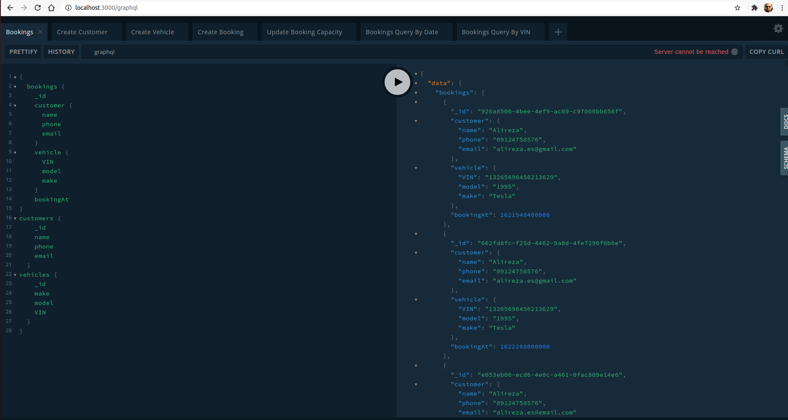

<p align="center">
  
  
  
# Description
An MVP program that would manage bookings for a Dealership.
The program can accept or reject bookings based on availabilities.
## Definition
- The working hours of a dealership is 9AM - 5PM
- A Booking is 2 hours long
## Booking Capacity Endpoint
The booking capacity can be define via an endpoint (default should be 2). Meaning that 2 bookings can be executed at the same time.
## Booking Creation Endpoint
An endpoint that allows us to create a Booking, with the following data:

**Customer:**
- Customer Name
- Customer Email
- Customer Phone Number

**Vehicle:**
- Vehicle Make
- Vehicle Model
- Vehicle VIN (17 length String)

**Booking:**
- Date/Time

It will return proper error if booking isn't possible (exceeds capacity, outside of working hours).

## Booking Retrieval Endpoint
Endpoint that would return all the Bookings for a provided Day.
## Extra points
Endpoint that would return the bookings for a vehicle VIN.

# Installation & Run
## 1. Install the project packages
```bash
$ npm install
```

## 2. Running the app

```bash
# development
$ npm run start

# production mode
$ npm run start:prod
```
## 3. Open the GraphQL endpoint
Open the graphQL endpoint on: 
<a href="http://localhost:3000/graphql" target="_blank">`http://localhost:3000/graphql`</a>

